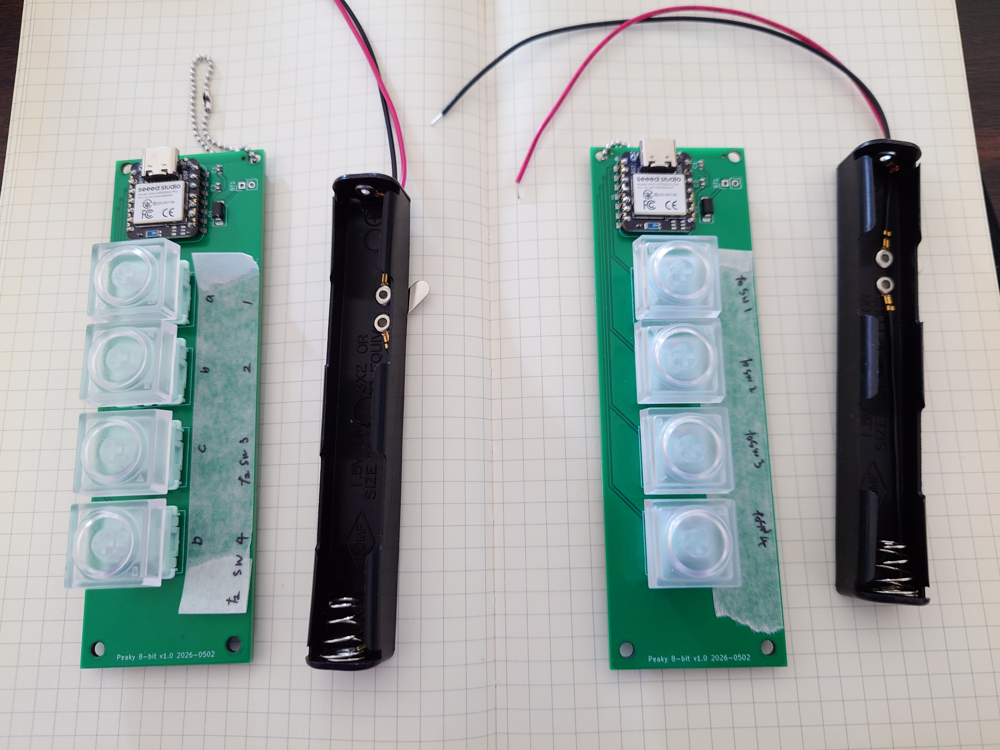

# Peaky 8-bit

A handheld, wireless, 8-key chording keyboard for typing on the go — even while walking.



## What is this?

Peaky 8-bit is a split wireless keyboard with just 4 keys per hand (8 total). It uses **binary chord input** — pressing combinations of keys simultaneously — to produce 2⁸ = 256 different outputs. That's enough to cover full Japanese (hiragana via romaji) and English text, numbers, symbols, and modifiers.

Think of it as a handheld input device shaped like VR controllers, designed to let you type without a desk.

## Status

🚧 **Work in Progress** — This is an active, evolving project. The keymap changes frequently as I refine the layout through daily use. Expect commits to land regularly.

Tagged [releases](../../releases) mark stable snapshots with pre-built `.uf2` firmware files.

## Hardware

| Component | Details |
|---|---|
| MCU | [Seeed Studio XIAO nRF52840 (Plus)](https://www.seeedstudio.com/XIAO-p-5928.html) × 2 |
| Switches | Cherry MX compatible × 8 (4 per hand) |
| Connection | Bluetooth Low Energy (split: left = central, right = peripheral) |
| Power | 2× AA batteries per hand (no lithium, no charging circuit) |
| PCB | Custom designed, same board for left and right |
| Case | 3D printed (designed in Blender) |

> **Certification:** The XIAO nRF52840 module holds FCC, CE, and Japan TELEC (技適) certifications. No additional wireless certification is required when using it as a pre-certified module.

## Firmware

Built on [ZMK Firmware](https://zmk.dev/) (Zephyr-based, open source).

The entire input system is implemented using ZMK's **combos** feature — each chord pattern maps to a combo that triggers a macro. The keymap currently defines ~230 actions across ~350 combos.

### Building

This is a standard ZMK user config repository. To build:

1. Fork this repository
2. Push to trigger GitHub Actions
3. Download the `.uf2` artifacts from the Actions tab
4. Flash to each XIAO: enter bootloader mode (double-tap RST), drag & drop the `.uf2`

Or build locally with the ZMK toolchain — see [ZMK docs](https://zmk.dev/docs/development/setup/native).

### Keymap

The chord-to-character mapping is documented in detail:

- **[Binary Chords Spec v0.3](docs/binary-chords-spec-v0_3.md)** — Full 256-pattern keymap specification
- **[keymap_v03.csv](docs/keymap_v03.csv)** — Machine-readable keymap data
- **[gen_keymap.py](docs/gen_keymap.py)** — Python script that generates the ZMK keymap from the CSV

The keymap is optimized for **Japanese input** (romaji → kana via IME), with a full English alphabet layer. The layout uses a logical structure: Japanese syllable rows (あ行, か行, さ行...) are mapped to binary ranges, making chords easier to memorize.

## Repository Structure

```
├── boards/shields/peaky8bit/   # ZMK shield definition
│   ├── peaky8bit.keymap        # Generated keymap (combos + macros)
│   ├── peaky8bit.conf          # ZMK config (combo limits, etc.)
│   ├── peaky8bit.dtsi          # Common shield definitions
│   ├── peaky8bit_left.overlay  # Left hand (central) GPIO config
│   └── peaky8bit_right.overlay # Right hand (peripheral) GPIO config
├── docs/
│   ├── binary-chords-spec-v0_3.md  # Keymap specification
│   ├── keymap_v03.csv              # Keymap data (CSV)
│   └── gen_keymap.py               # Keymap generator script
├── hardware/                   # PCB design files (coming soon)
├── case/                       # 3D printable case (coming soon)
├── build.yaml                  # GitHub Actions build matrix
└── config/west.yml             # ZMK west manifest
```

## How chord input works

Each key is a single bit. Pressing keys simultaneously creates a binary value:

```
Left hand:  [bit7] [bit6] [bit5] [bit4]
Right hand: [bit3] [bit2] [bit1] [bit0]

Example: pressing left-key1 + right-key1 + right-key2
         = bit7 + bit3 + bit2
         = 1000 1100
         = 0x8C
         = Shift+Ctrl modifier arm
```

A single chord can output a full Japanese syllable (e.g. 0x21 = "ka" → か), a control key, a symbol, or arm a modifier for the next chord.

## Links

- 📝 **Build log & updates:** [toya-works on Substack](https://toyamimura.substack.com/s/peaky-8-bit)
- 💬 **Original announcement:** [r/ErgoMechKeyboards on Reddit](https://www.reddit.com/r/ErgoMechKeyboards/comments/1tkf39y/wip_building_a_handheld_8key_chording_keyboard_to/)
- ☕ **Support this project:** [Buy Me a Coffee](https://buymeacoffee.com/toyaworks)

## PCB Manufacturing

The v2.0 PCBs for this project are manufactured and assembled by **[PCBWay](https://www.pcbway.com/)**. PCBWay handled the board fabrication and SMT soldering for the passive components (bypass caps and diode), with a clean matte-green finish and solid GND fill. The [KiCad plugin](https://www.pcbway.com/blog/News/PCBWay_Plug_In_for_KiCad_3ea6219c.html) made uploading Gerber files and BOM straightforward.

For a detailed walkthrough of the ordering process and unboxing, see the [build log on Substack](https://toyamimura.substack.com/s/peaky-8-bit).

Gerber files, BOM, and pick-and-place files are available in [`hardware/v2.0_pcbway_2026_0601/`](hardware/v2.0_pcbway_2026_0601/). See the readme.txt inside for important notes on which components to include in SMT assembly orders.

## License

- **Hardware** (PCB design, case): [CERN-OHL-P v2](https://ohwr.org/cern_ohl_p_v2.txt)
- **Firmware config** (ZMK keymap, macros): [MIT License](LICENSE)
- **Documentation**: [CC BY-SA 4.0](https://creativecommons.org/licenses/by-sa/4.0/)

## Author

**toya** ([@miumra](https://www.reddit.com/user/miumra) on Reddit)

This is a personal passion project, and I'm learning as I go — progress is slow but steady.
